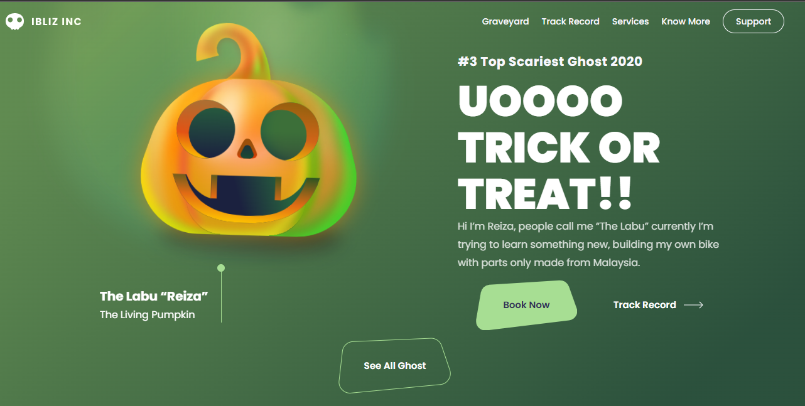
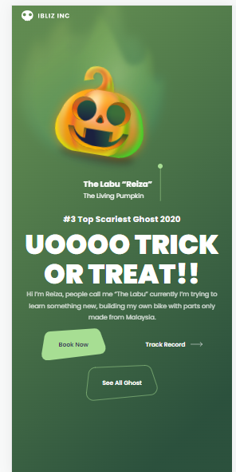

<h1>login-app-dev-club</h1>
 
 
<h2> Esse foi um projeto praticado no <a href="https://www.rodolfomori.com.br/devclub">DevClub</h2>
 <h2>Tecnologias utilizadas</h2> 
 
 
  
  
  <h3>Confira a aplicação <a href="https://jeanspereira.github.io/halloween-devclub-class/">Aqui!</a>
  
  
 
 
 

">
